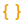
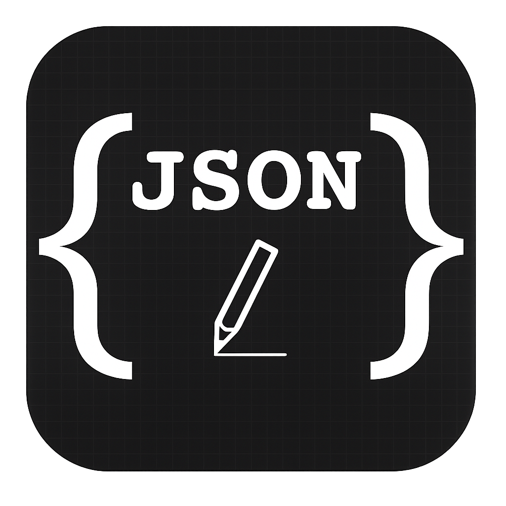

<!-- ====== ANIMATED HEADER ====== -->


<p align="center">
  
</p>

## ⚡ Tech Stack

<p align="center">
  
</p>

## 🛠️ Tools

<p align="center">
  
</p>

## 📊 GitHub Stats

<p align="center">
  
  
</p>

<p align="center">
  
</p>

<p align="center">
  
</p>

<!-- WAKATIME-START -->
**All-time coding:** N/A

<details><summary>📊 Posledních 7 dní</summary>

```
Čtv │ 0 secs       ⬜⬜⬜⬜⬜⬜⬜⬜⬜⬜⬜⬜⬜⬜⬜⬜⬜⬜⬜⬜⬜⬜⬜⬜⬜
Pát │ 0 secs       ⬜⬜⬜⬜⬜⬜⬜⬜⬜⬜⬜⬜⬜⬜⬜⬜⬜⬜⬜⬜⬜⬜⬜⬜⬜
Sob │ 0 secs       ⬜⬜⬜⬜⬜⬜⬜⬜⬜⬜⬜⬜⬜⬜⬜⬜⬜⬜⬜⬜⬜⬜⬜⬜⬜
Ned │ 0 secs       ⬜⬜⬜⬜⬜⬜⬜⬜⬜⬜⬜⬜⬜⬜⬜⬜⬜⬜⬜⬜⬜⬜⬜⬜⬜
Pon │ 0 secs       ⬜⬜⬜⬜⬜⬜⬜⬜⬜⬜⬜⬜⬜⬜⬜⬜⬜⬜⬜⬜⬜⬜⬜⬜⬜
Úte │ 5 hrs 59 mins 🟩🟩🟩🟩🟩🟩🟩🟩🟩🟩🟩🟩🟩🟩🟩🟩🟩🟩🟩🟩🟩🟩🟩🟩🟩
Stř │ 1 hr 34 mins 🟩🟩🟩🟩🟩🟩🟨⬜⬜⬜⬜⬜⬜⬜⬜⬜⬜⬜⬜⬜⬜⬜⬜⬜⬜
```
</details>
<!-- WAKATIME-END -->

## Languages

<!-- LANGS-START -->
 `48.1%` &nbsp;&nbsp;&nbsp;&nbsp;  `37.4%` &nbsp;&nbsp;&nbsp;&nbsp;  `6.4%` &nbsp;&nbsp;&nbsp;&nbsp;  `3.3%`

 `1.6%` &nbsp;&nbsp;&nbsp;&nbsp;  `1.1%` &nbsp;&nbsp;&nbsp;&nbsp;  `1.0%` &nbsp;&nbsp;&nbsp;&nbsp;  `1.0%`

 `0.2%`
<!-- LANGS-END -->

<!-- SPARK-START -->
<p align="center">
<svg width="120" height="30" xmlns="http://www.w3.org/2000/svg">
  <polyline
    fill="none"
    stroke="#10b981"
    stroke-width="1.5"
    points="2,28 21.333333333333332,28 40.666666666666664,28 60,28 79.33333333333333,28 98.66666666666667,2 118,21.167028329200754"
  />
</svg>
</p>
<!-- SPARK-END -->

## 📦 Top Repos

<!-- REPOS-START -->
**skJson** 
> About Script Addon for using Json (Gson) in script
`⭐ 21 • 🍴 4 • 📅 14. 08. 25` • `Java`

**SkriptMail** 
> The Simple Skript Mailer using Kotlin JDK
`⭐ 4 • 📅 10. 05. 25` • `Kotlin`

**Jsonic** 
> Blazing fast JSON, HTTP, and WebSocket utilities for Skript.
`⭐ 1 • 📅 16. 08. 25` • `Other`

**skGoat** 
> Addon that fills in missing syntax, and improves working with inventories
`⭐ 1 • 🍴 1 • 📅 06. 05. 25` • `Java`

**cooffeeRequired** 
> My page
`📅 27. 08. 25` • `JavaScript`


<!-- REPOS-END -->

## 📝 Recent Commits (profile repo)

<!-- COMMITS-START -->
**📝 commit** (27. 08. 25 02:42)
> update
by **Jiří Grygerek** • [view commit](https://github.com/cooffeeRequired/cooffeeRequired/commit/00dbc8d5517afcbef1fe6fc264488d82c5257769)

**📝 commit** (27. 08. 25 02:40)
> update
by **Jiří Grygerek** • [view commit](https://github.com/cooffeeRequired/cooffeeRequired/commit/7706c4282b92401f423b42258119548b5955a7c7)

**📝 commit** (27. 08. 25 02:38)
> update
by **Jiří Grygerek** • [view commit](https://github.com/cooffeeRequired/cooffeeRequired/commit/482aea70d846cddd75e9b10b4ea76a81b838681b)

**📝 commit** (27. 08. 25 02:36)
> update
by **Jiří Grygerek** • [view commit](https://github.com/cooffeeRequired/cooffeeRequired/commit/0003c9673f1dc2430d429de0e9c71940618db254)

**📝 commit** (27. 08. 25 02:36)
> update
by **Jiří Grygerek** • [view commit](https://github.com/cooffeeRequired/cooffeeRequired/commit/31a81654ab9974bc44aa6ea8656842a30bc65fa8)


<!-- COMMITS-END -->

---


